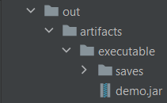

## ProjetS3-Rakowski-Sadi-Delalande-Thorel
<h3>Le git OFFICIEL de notre projet de semestre 3 qui porte sur un simulateur de trajectoire de planètes et qui est tutoré par monsieur Rosenfeld</h3>

*Pour obtenir l'exécutable de notre projet suivez le chemin ci- dessous*

